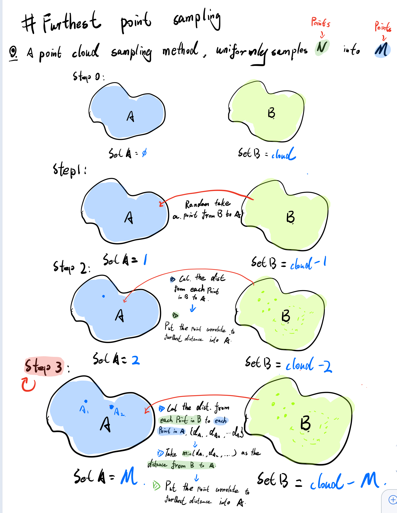
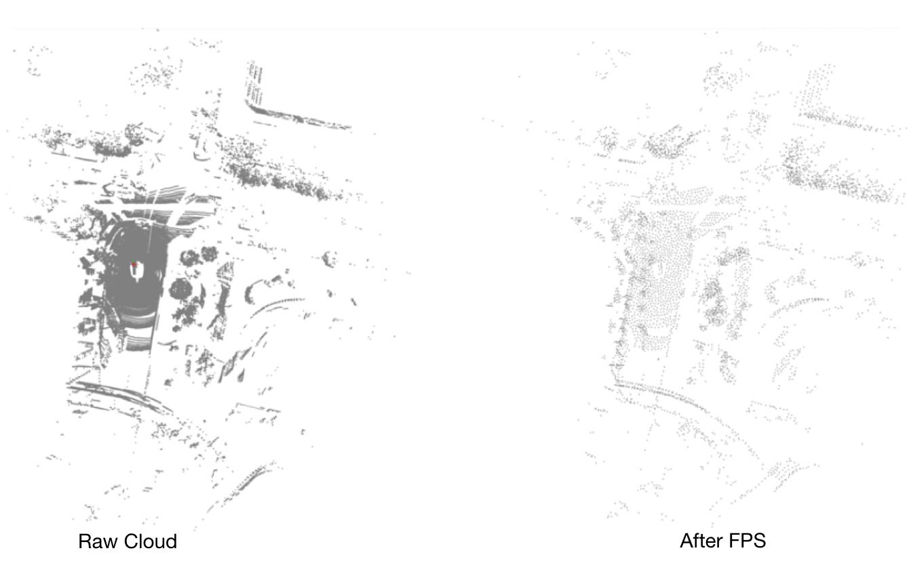

# Fusthest Point Sampling

**Fusthest Point Sampling (FPS)** is often used as a key point extraction method, which is widely used in 3D object detection algorithm based on deep learning, such as PointNet++ , VoteNet , PV-RCNN ...

* Here, the related cuda implementations of FPS in [Pointnet2.Pytorch](https://github.com/sshaoshuai/Pointnet2.PyTorch) and [Pointnet2_Pytorch](https://github.com/erikwijmans/Pointnet2_PyTorch) are sorted out separately, which is convenient for use in other places.
* And, i also use [Open3d.Python](https://github.com/intel-isl/Open3D) for visual description, in order to clearly understand the useage of this algorithm.

# Sketch Map


# Usage
```bash
mkdir build && cd build
cmake .. && make 
./fps_test > demo.txt
python ../tools/viewer.py
```

# Visualization


# Reference
* [Pointnet2.Pytorch](https://github.com/sshaoshuai/Pointnet2.PyTorch)
* [Pointnet2_Pytorch](https://github.com/erikwijmans/Pointnet2_PyTorch) 
* [Farthest Point Sampling (FPS)算法核心思想解析](https://zhuanlan.zhihu.com/p/114522377)